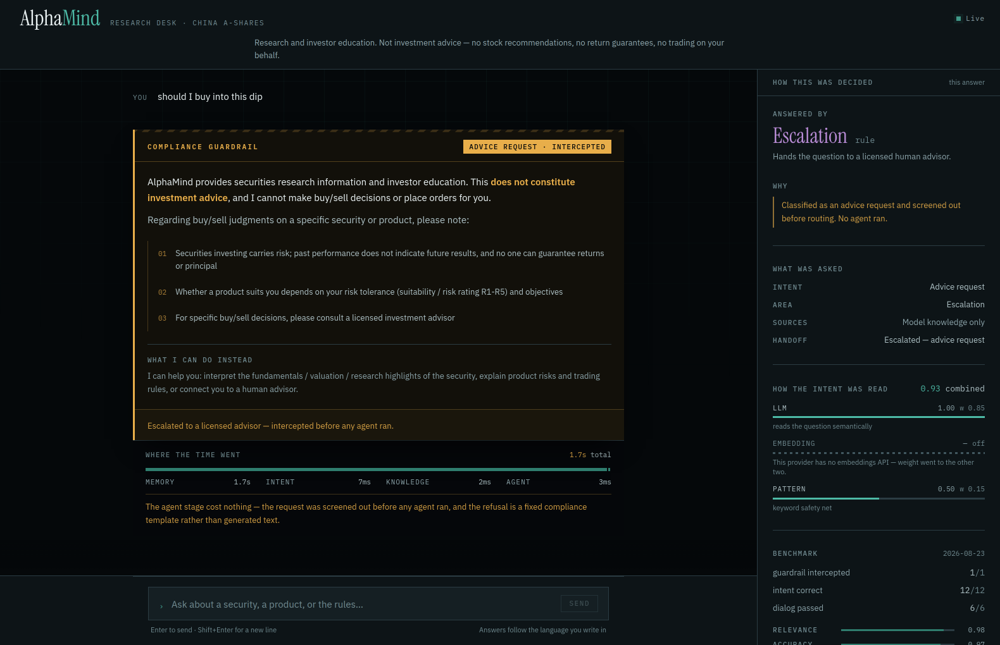
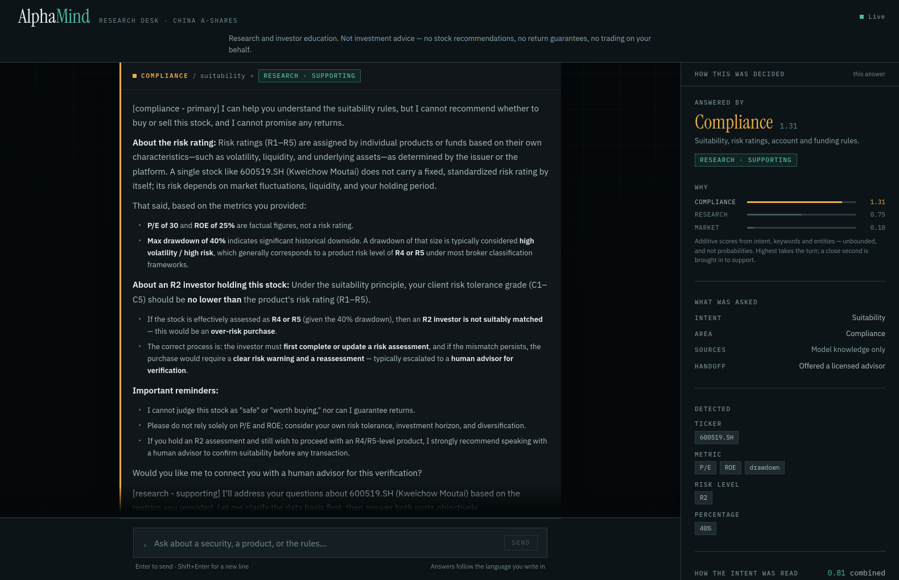

# AlphaMind — Securities Investment-Research Assistant

> AlphaMind is a **multi-agent runtime** for securities investment research — analyst-style Q&A, investor education, and report and data retrieval.
> **It does not constitute investment advice; it does not recommend stocks, promise returns, or trade on your behalf.** Requests of that kind are intercepted by an **investment-advice guardrail** and escalated to a human advisor.
>
> Ask in English or Chinese — the reply comes back in the same language.



Core flow:

```text
User request
  -> FastAPI /chat
  -> MemoryManager reads Redis working memory + ChromaDB episodic memory + user profile
  -> IntentRecognizer classifies intent by weighted vote across LLM / embedding / keyword routes
  -> ⚠️ Investment-advice guardrail: stock picks / timing / guaranteed returns / trade-for-me -> intercept + risk disclosure + escalate
  -> Intent-gated RAG (query rewrite -> parallel recall -> dedup -> LLM rerank)
  -> AgentOrchestrator routes to Market / Research / Compliance agents (primary + supporting)
  -> inject dynamic Skills -> LLM generates the reply
  -> write to Redis, async update ChromaDB user profile
  -> Monitor online routing penalty + LLM-as-Judge evaluation loop
```

## 1. Capabilities

| Capability | Description |
|------------|-------------|
| Intent recognition | 21 securities intents in three groups + guardrail; weighted vote across three routes, re-weighted when one is unavailable (see note below) |
| **Investment-advice guardrail** | intent-gated guardrail: stock-pick / timing / guaranteed-return / trade-for-me requests are intercepted, returning a risk disclosure and escalating to a human advisor |
| Intent-gated RAG | only business-information intents query the ChromaDB knowledge base; query rewrite, parallel recall, dedup, LLM rerank |
| Multi-agent routing | Market & Information / Research & Analysis / Compliance & Suitability; outputs primary + supporting, `routing_reason`, and `routing_score` — an additive domain score, not a probability |
| Layered memory | Redis working memory (24h TTL) + ChromaDB episodic memory + user profile; auto-compress over threshold |
| Dynamic Skills | market / research / compliance guidelines, injected by agent type + keywords, hot-reloadable |
| Tool reliability | parameter validation, TTL cache, timeout, circuit breaker, and fallback for the knowledge-search tool |
| Observability & evaluation | Monitor writes back `routing_penalty` from success rate and latency; LLM-as-Judge four-dimension scoring + guardrail hit rate + regression detection |

> [!NOTE]
> Two of the three intent routes are live. The embedding route is switched off whenever
> `ANTHROPIC_BASE_URL` points at a third-party endpoint, and the weights re-table to LLM 0.85 /
> keywords 0.15 (`core/intent_recognizer.py:179`). A route that did not run is left out of the
> response rather than scored 0.0, so a disabled route is not mistaken for one that scored
> nothing. This concerns the intent recognizer only — the knowledge base and episodic memory
> use ChromaDB with `all-MiniLM-L6-v2`.

## 2. Agents

| Agent | Responsibility |
|-------|----------------|
| **MarketAgent** (Market & Information) | quotes / indices / ETF & stock product info / term explanations; state facts, no price predictions |
| **ResearchAgent** (Research & Analysis) | research retrieval, financials/fundamentals, valuation and quant concepts (factor/backtest/Sharpe/drawdown); interpret only, no buy/sell conclusions |
| **ComplianceAgent** (Compliance & Suitability) | risk ratings R1–R5, suitability matching, risk disclosure, account opening, trading rules & fees |
| **Escalation** (human advisor) | on guardrail hits, complaints, or serious suitability mismatch, transfer to a human advisor |

## 3. Intents (21: three groups + flow & guardrail)

- **Market group → Market**: `market_quote` `product_info` `term_explain` `trading_rule`
- **Research group → Research**: `research_report` `fundamental` `valuation` `comparison` `quant_concept`
- **Compliance group → Compliance**: `account` `funding` `suitability` `risk_disclosure` `statement`
- **Flow / guardrail**: ⚠️`advice_request` (stock picks / timing / guaranteed returns / trade-for-me), `complaint` `human_handoff` `escalation` `greeting` `feedback` `other`

## 4. Quick start

### 4.1 Requirements

- Python 3.12 and Redis — or Docker + Docker Compose, which brings both
- Node 20.19+ if you want the web UI (Vite 8)
- An Anthropic API key, or an Anthropic-compatible third-party key (e.g., DeepSeek)

Configure `.env` (minimum):

```env
ANTHROPIC_API_KEY=your_api_key
# Third-party compatible endpoint example:
# ANTHROPIC_BASE_URL=https://api.deepseek.com/anthropic
# Use deepseek-chat. Do NOT use deepseek-v4-pro: it is a reasoning model whose
# thinking block consumes the whole max_tokens budget, leaving the text block empty.
# ANTHROPIC_MODEL=deepseek-chat
```

### 4.2 Run it locally

This is how the project is developed and tested.

```bash
python -m venv .venv && .venv/bin/pip install -r requirements.txt
redis-server --daemonize yes                     # or any reachable Redis

export REDIS_URL="redis://127.0.0.1:6379/0"
export CHROMA_PERSIST_DIRECTORY="$PWD/data/chroma"   # embedded ChromaDB, no server needed
.venv/bin/python api/main.py                     # http://localhost:8000  ·  /docs for Swagger
```

The defaults in `api/main.py` are container hostnames (`redis`, `chromadb`), so those two
variables are what a local run needs. On first start the knowledge base seeds itself with the
eight default documents.

### 4.3 Full stack via Docker Compose

```bash
docker compose up -d --build
docker compose logs -f alphamind
curl http://localhost:8000/health
```

Starts: AlphaMind API (8000), Nginx (80), ChromaDB (8001), Redis (6379), Prometheus (9090).

### 4.4 Web UI

```bash
cd frontend && npm install && npm run dev        # http://localhost:5173
```

A research-terminal front end for the same API — see [`frontend/README.md`](frontend/README.md).
It is built to make the routing legible, not to be a chat window: every answer carries the
agent that took it, the scores of the ones that did not, the intent vote including the route
that is switched off, and where the milliseconds went.



Dev requests go to `/api/*` and Vite proxies them to `:8000`, so the browser stays same-origin.
No credentials live in the frontend — the model API key is backend-only.

### 4.5 CLI

```bash
.venv/bin/python api/main.py --cli
# or, in Docker: docker compose run --rm alphamind python api/main.py --cli
```

### 4.6 Run tests

```bash
.venv/bin/pip install -r requirements-dev.txt
.venv/bin/python -m pytest tests/ -q    # intent / routing / guardrail / skills. No network, no API key.
cd frontend && npm test                 # markdown renderer + the guardrail discriminator
```

### 4.7 Security

> [!IMPORTANT]
> The API has no authentication, no rate limiting, and `allow_origins=["*"]`. It is built to run
> locally against your own key. Do not put it on a public address as it stands.

## 5. API overview

| Method | Path | Purpose |
|--------|------|---------|
| `GET` | `/health` | liveness, plus per-agent success rate, latency and routing score |
| `POST` | `/chat` | main chat: memory -> intent -> guardrail -> gated RAG -> routing -> reply |
| `POST` | `/search` | RAG retrieval pipeline (query rewrite / parallel recall / rerank) |
| `GET` | `/monitor` | agent and tool metrics, alerts, suggestions |
| `GET` | `/metrics` | Prometheus scrape endpoint |
| `GET` | `/skills` | view the loaded dynamic Skills |
| `POST` | `/skills/reload` | hot-reload them from disk |
| `POST` | `/knowledge/add` `/knowledge/upload` | import knowledge-base documents |
| `GET` | `/knowledge/stats` | knowledge-base chunk count |
| `POST` | `/eval/run` | end-to-end evaluation, including `guardrail_hit_rate` |

### 5.1 /chat examples

Information question — routes to Market, and the knowledge base is consulted:

```bash
curl -X POST http://localhost:8000/chat -H "Content-Type: application/json" -d '{
  "message": "What are the fee and tracking error of the CSI 300 ETF?",
  "user_id": "u1", "conv_id": "c1"
}'
```

Suitability question — routes to Compliance:

```bash
curl -X POST http://localhost:8000/chat -H "Content-Type: application/json" -d '{
  "message": "My risk assessment is R2, can I open margin trading?", "user_id": "u1", "conv_id": "c1"
}'
```

⚠️ Guardrail example (stock-pick request -> refuse + risk disclosure + escalate):

```bash
curl -X POST http://localhost:8000/chat -H "Content-Type: application/json" -d '{
  "message": "Recommend me a stock that can double, ideally rising tomorrow", "user_id": "u1", "conv_id": "c1"
}'
# Returns escalated=true; the reply carries the risk disclosure and points at a human advisor
```

Both of the last two return `escalated: true`: the Compliance answer offers a human advisor on
its own, while the third never reached an agent. What separates them is `routing_reason`, which
the guardrail prefixes with `guardrail=`.

## 6. Knowledge base

`mcp/knowledge_base.py` backs the ChromaDB `knowledge_base` collection. If the collection is
empty on start it seeds itself with eight securities documents:

| | |
|---|---|
| Investment terms & metrics glossary | Securities trading rules |
| ETF product guide | Risk disclosure essentials |
| Investor suitability & risk ratings | Account opening & management |
| Financial statement & fundamentals guide | Compliance red lines & investor education |

Sample files for `/knowledge/upload` are under `data/demo_docs/`.

## 7. Memory & evaluation

- **Layered memory**: Redis `wm:{user}:{conv}` (24h TTL, compress at 15 messages, keep the latest 5); ChromaDB `episodic` (history summaries) and `user_profile`.
- **Evaluation**: `POST /eval/run` runs the questions through the Orchestrator, scores the replies with LLM-as-Judge on four dimensions (relevance / accuracy / completeness / helpfulness), and reports `guardrail_hit_rate`, intent Accuracy and Macro-F1, and regression against the previous run.

## 8. Tech stack

**Backend** — Python 3.12 · FastAPI · Anthropic SDK (DeepSeek-compatible) · Redis · ChromaDB · Prometheus · Docker Compose · pytest

**Frontend** — React 19 · Vite · Tailwind CSS 4 · Vitest

## 9. Compliance notice

AlphaMind is a personal engineering project. It is not a licensed financial service, it is not
affiliated with any broker or exchange, and its knowledge base is a small set of illustrative
documents rather than authoritative source material. Nothing it produces is investment advice.
For an actual investment decision, consult a licensed advisor and judge independently against
your own risk tolerance.
